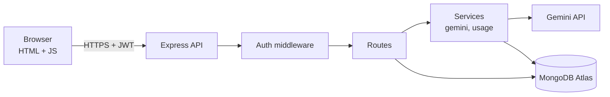
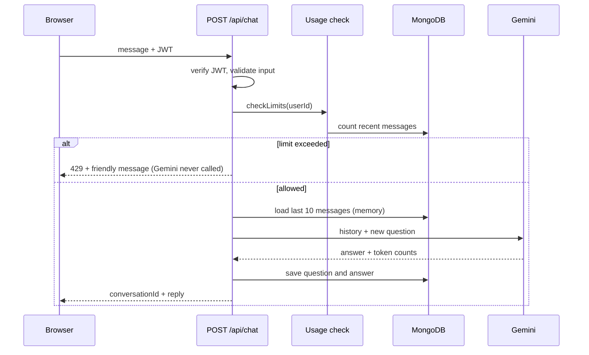
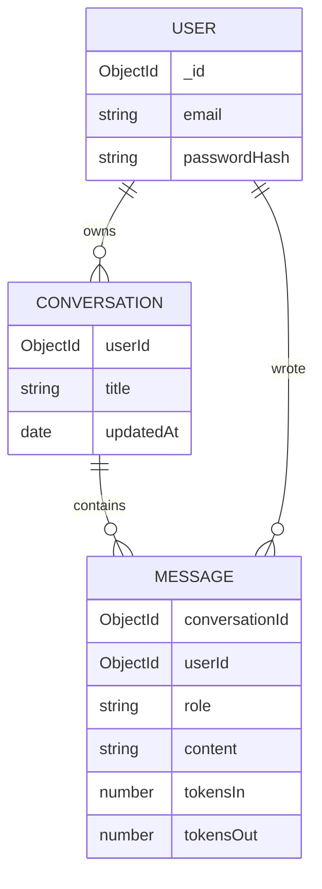

# docuchat
Chat with your documents: Node.js, Express, MongoDB, Gemini RAG
# DocuChat

> An AI chat application with per-user conversation memory, built on Node.js, Express and MongoDB, powered by Google Gemini. Document Q&A (RAG) is the next milestone.


<!-- Add after recording:  -->
<!-- Live demo: https://YOUR-LINK -->

---

## Status

| Feature | State |
|---|---|
| Register / login (JWT, bcrypt) | Done |
| Protected API routes | Done |
| Gemini chat with conversation memory | Done |
| Chats and messages saved per user | Done |
| Usage limits (per user per minute, per user per day, app-wide) | Done |
| Chat history sidebar | In progress |
| Streaming responses (SSE) | Planned |
| Document upload + RAG (Atlas Vector Search) | Planned |
| Usage analytics (aggregation pipelines) | Planned |
| Tests, CI, deployment | Planned |

---

## Tech Stack

| Layer | Technology | Purpose |
|---|---|---|
| Runtime | Node.js 24 (ES modules) | Non-blocking I/O suits an app that mostly waits on the database and the LLM |
| Web framework | Express 5 | REST API; async errors are forwarded to the error handler automatically |
| Database | MongoDB Atlas (free tier) | Users, conversations, messages |
| ODM | Mongoose 9 | Schemas, validation, indexes |
| LLM | Google Gemini via `@google/genai` | Chat completions |
| Auth | JWT (`jsonwebtoken`) + `bcryptjs` | Stateless sessions, hashed passwords |
| Config | `dotenv` | Secrets kept out of Git |
| Frontend | Vanilla HTML, CSS, JavaScript | Served statically by Express, no build step |

---

## Architecture



**Layering:** Route (HTTP only) → Service (business rules, external calls) → Model (schema and persistence). The Gemini code lives in one file, so swapping the model or provider touches nothing else.

---

## High-Level Design: one chat request



Design points:

- **Gemini is called before anything is saved**, so a failed AI call leaves no half-saved conversation.
- **Limits run before the AI call**, so blocked requests cost no quota.
- **Memory** is the last 10 messages sent with each request, because the model itself keeps no state.

---

## Low-Level Design

### Data model



| Collection | Index | Why |
|---|---|---|
| `users` | unique `email` | One account per email |
| `conversations` | `{ userId, updatedAt: -1 }` | "My chats, newest first" without a collection scan |
| `messages` | `{ conversationId, createdAt }` | "This chat in order" without a collection scan |

Messages are a separate collection, so a long chat never inflates one document and can be paged.

### API

| Method | Route | Auth | Description |
|---|---|---|---|
| POST | `/api/auth/register` | No | Create account, returns JWT |
| POST | `/api/auth/login` | No | Returns JWT |
| GET | `/api/auth/me` | Yes | Current user |
| POST | `/api/chat` | Yes | Ask a question, optionally continue a conversation |
| GET | `/api/conversations` | Yes | List my conversations (in progress) |
| GET | `/api/health` | No | Health check |

### Usage limits

| Rule | Value |
|---|---|
| Messages per user per minute | 3 |
| Messages per user per day | 20 |
| Messages per day, whole app | 450 |

The app shares one free-tier Gemini key, so limits protect the daily request budget. Counts are derived from saved messages, so no extra collection or in-memory state is needed, which also keeps the app compatible with serverless hosting. The day boundary follows Pacific midnight, matching how Google's daily quota resets.

### Project structure

```
docuchat/
├── public/            Static frontend (index.html, style.css, app.js)
├── scripts/           Dev utilities (Gemini test, data inspection)
└── src/
    ├── app.js         Express app wiring
    ├── server.js      Boot: connect DB, then listen
    ├── config/        db.js, limits.js
    ├── middleware/    auth.js (JWT guard)
    ├── models/        User, Conversation, Message
    ├── routes/        auth, chat, conversations
    ├── services/      gemini.js, usage.js
    └── utils/         pacificTime.js
```

---

## Security

- Passwords hashed with bcrypt (cost 12); the hash is excluded from queries by default.
- Login returns the same error for an unknown email and a wrong password, so registered emails cannot be discovered.
- Every conversation query filters by the authenticated `userId`; another user's conversation id returns "not found".
- Secrets live in `.env` (git-ignored); `.env.example` documents the variables.
- Input is validated (type, empty, length cap) before any database or AI call.
- Frontend renders text with `textContent`, avoiding script injection.

---

## Getting Started

**Requirements:** Node.js 22+, a MongoDB Atlas cluster, a Gemini API key.

```bash
git clone https://github.com/Milind300/docuchat.git
cd docuchat
npm install
cp .env.example .env     # Windows: copy .env.example .env
npm run dev
```

Open http://localhost:4000.

**Environment variables**

| Variable | Description |
|---|---|
| `MONGO_URI` | MongoDB Atlas connection string, with database name `docuchat` |
| `PORT` | Server port (default 4000) |
| `JWT_SECRET` | Long random string used to sign tokens |
| `GEMINI_API_KEY` | Google AI Studio key |
| `GEMINI_MODEL` | Chat model ID (kept in config because free-tier models change) |

---

## Known Limitations

- **Free-tier privacy:** Google may use free-tier prompts for product improvement. Do not send sensitive data.
- **Shared quota:** one Gemini key serves all users, so the app-wide cap can run out; the UI shows a clear message.
- **Limit check is not atomic:** two simultaneous requests could both pass before either is saved. A stricter version would reserve the slot first.
- **JWT in `localStorage`:** simple, but readable by injected scripts. An httpOnly cookie is the production alternative.
- **7-day tokens cannot be revoked early;** refresh-token rotation is a possible upgrade.
- **Markdown in answers is shown as plain text** for now.

---

## Roadmap

1. Chat history sidebar
2. Streaming responses with Server-Sent Events
3. Document upload, chunking, embeddings and retrieval with Atlas Vector Search, with source citations
4. Analytics endpoints (messages per day, tokens per user)
5. Tests, GitHub Actions, deployment

---

## License

MIT