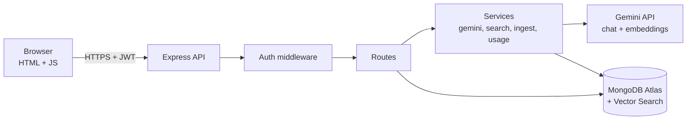
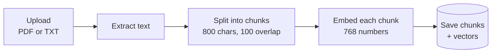
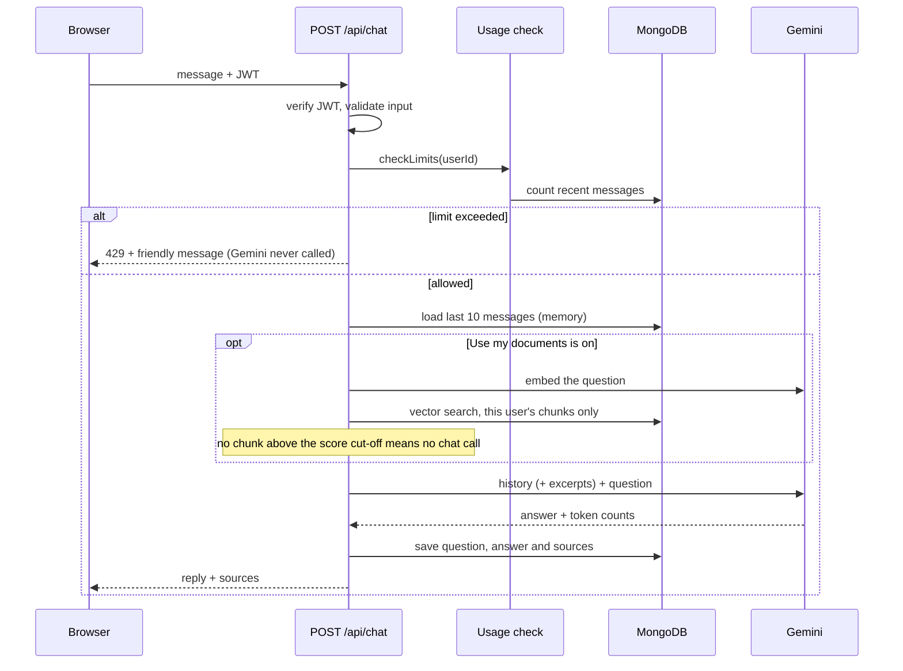
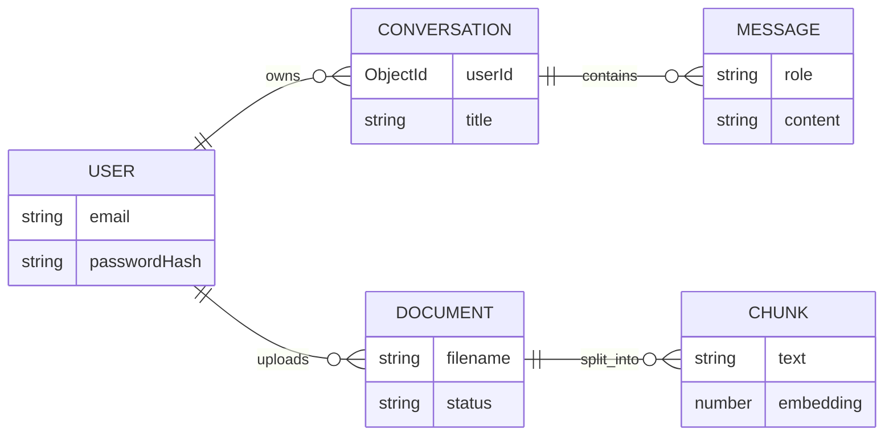

# DocuChat

> Chat with an AI, or chat with your own documents. Built on Node.js, Express and MongoDB, powered by Google Gemini. Upload a PDF or TXT, ask questions, and get answers grounded in the file, with the source passages shown.


<!-- Add after recording:  -->
<!-- Live demo: https://YOUR-LINK -->

---

## Status

| Feature | State |
|---|---|
| Register / login (JWT, bcrypt), protected routes | Done |
| Gemini chat with conversation memory | Done |
| Saved chats, history sidebar | Done |
| Usage limits (per user per minute, per user per day, app-wide) | Done |
| Formatted answers (bold, lists, code) | Done |
| Document upload: PDF and TXT, chunking, embeddings | Done |
| Vector search (Atlas Vector Search), per-user filtered | Done |
| Answers from documents with source passages | Done |
| Upload button and document list in the UI | Done |
| Delete a document (API) | Done |
| Delete button in the UI | In progress |
| App-wide embedding quota cap | Planned |
| Login rate limiting, security headers | Planned |
| Streaming responses (SSE) | Planned |
| Usage analytics (aggregation pipelines) | Planned |
| Tests, CI, deployment | Planned |

---

## Tech Stack

| Layer | Technology | Purpose |
|---|---|---|
| Runtime | Node.js 24 (ES modules) | Non-blocking I/O suits an app that mostly waits on the database and the LLM |
| Web framework | Express 5 | REST API; async errors reach the error handler automatically |
| Database | MongoDB Atlas (free tier) | Users, chats, documents, chunks |
| ODM | Mongoose 9 | Schemas, validation, indexes |
| Vector search | Atlas Vector Search (`$vectorSearch`) | Similarity search in the same database, no separate vector store |
| Chat model | Google Gemini via `@google/genai` | Answers |
| Embeddings | `gemini-embedding-001`, 768 dimensions | Turns text into vectors |
| Auth | JWT (`jsonwebtoken`) + `bcryptjs` | Stateless sessions, hashed passwords |
| File upload | `multer` (memory storage) | Files are processed in memory, never written to disk |
| PDF parsing | `unpdf` | Text extraction from PDFs |
| Config | `dotenv` | Secrets kept out of Git |
| Frontend | Vanilla HTML, CSS, JavaScript | Served by Express, no build step |

---

## Architecture



**Layering:** Route (HTTP only) → Service (business rules, external calls) → Model (schema and persistence). All Gemini calls live in two small service files, so swapping the model or provider touches nothing else.

---

## High-Level Design

### Ingestion: from file to searchable chunks



If any step fails, partly saved chunks are removed and the document is marked `FAILED` with the reason.

### One chat request



Design points:

- **Gemini is called before anything is saved**, so a failed AI call leaves no half-saved conversation.
- **Limits run before any AI call**, so blocked requests cost no quota.
- **Memory** is the last 10 messages sent with each request, because the model itself keeps no state.
- **Retrieval** keeps the top 4 chunks scoring at least 0.765. If none qualify, the app answers "nothing relevant found" without calling the chat model.
- **Grounding:** the prompt tells the model to answer only from the excerpts, to treat them as data and not instructions, and to say when the answer isn't there.

---

## Low-Level Design

### Data model



| Collection | Index | Why |
|---|---|---|
| `users` | unique `email` | One account per email |
| `conversations` | `{ userId, updatedAt: -1 }` | "My chats, newest first" without a collection scan |
| `messages` | `{ conversationId, createdAt }` | "This chat in order" without a collection scan |
| `documents` | `{ userId, createdAt: -1 }` | "My documents" and the daily upload count |
| `chunks` | `{ documentId, index }`, `{ userId }` | Read a document in order; scope by owner |
| `chunks` (Atlas vector index) | `embedding`: 768 dims, cosine, filter on `userId` | Similarity search limited to the owner's chunks |

Notes:

- Messages are a separate collection, so a long chat never inflates one document.
- An assistant message stores the `sources` it used (document, chunk, score, snippet), so reopened chats show their sources.
- Embeddings are excluded from queries by default (`select: false`); a validator rejects any vector that isn't exactly 768 numbers.
- Documents have a status: `PROCESSING`, `READY`, `FAILED`, `DELETED`. Deleting removes the chunks and the document's entries in old answers' sources, and keeps the record so the daily upload count stays honest.

### API

| Method | Route | Auth | Description |
|---|---|---|---|
| POST | `/api/auth/register` | No | Create account, returns JWT |
| POST | `/api/auth/login` | No | Returns JWT |
| GET | `/api/auth/me` | Yes | Current user |
| POST | `/api/chat` | Yes | Ask a question. Body: `message`, optional `conversationId`, optional `useDocuments` |
| GET | `/api/conversations` | Yes | My conversations, newest first |
| GET | `/api/conversations/:id/messages` | Yes | One conversation's messages with sources |
| POST | `/api/documents` | Yes | Upload a PDF or TXT (multipart, field `file`) |
| GET | `/api/documents` | Yes | My documents |
| DELETE | `/api/documents/:id` | Yes | Delete one of my documents |
| GET | `/api/health` | No | Health check |

### Limits

| Rule | Value |
|---|---|
| Chat messages per user per minute | 3 |
| Chat messages per user per day | 20 |
| Chat messages per day, whole app | 450 |
| Document uploads per user per day | 3 (deleted ones still count) |
| File size / type | 4 MB, PDF or TXT |
| Chunks per document | 60 maximum, roughly 7 pages of text |

The app shares one free-tier Gemini key, so limits protect its daily quota. Counts come from saved data, so no in-memory state is needed, which suits serverless hosting. The day boundary follows Pacific midnight, matching how Google's daily quota resets.

Measured on the free tier: each chunk counts as one embedding request, so one 60-chunk upload uses 60 of the 100 per minute.

### Project structure

```
docuchat/
├── public/            Frontend: index.html, style.css, app.js, format.js
├── scripts/           Dev utilities (checks and experiments)
└── src/
    ├── app.js         Express app wiring
    ├── server.js      Boot: connect DB, then listen
    ├── config/        db.js, limits.js, rag.js
    ├── middleware/    auth.js (JWT guard)
    ├── models/        User, Conversation, Message, Document, Chunk
    ├── routes/        auth, chat, conversations, documents
    ├── services/      gemini, usage, chunker, embeddings, ingest, search, extract
    └── utils/         pacificTime.js
```

---

## Security and Privacy

- Passwords are hashed with bcrypt (cost 12); the hash is excluded from queries by default.
- Login returns the same error for an unknown email and a wrong password.
- Every chat, document and chunk query filters by the authenticated `userId`; another user's id returns "not found". The vector search is pre-filtered by `userId`, so one user's documents can never appear in another's answers.
- Uploaded files are processed in memory and never written to disk. Only PDF and TXT are accepted, up to 4 MB.
- Document text is treated as data in the prompt, and model output is rendered by a small formatter that builds elements with `textContent`, never `innerHTML`.
- Secrets live in `.env` (git-ignored); `.env.example` documents the variables.
- Input is validated (type, empty, length cap) before any database or AI call.
- **Free-tier privacy:** Google may use free-tier prompts for product improvement. Do not upload sensitive documents. The upload panel shows this warning.

---

## Getting Started

**Requirements:** Node.js 22+, a MongoDB Atlas cluster, a Gemini API key.

```bash
git clone https://github.com/Milind300/docuchat.git
cd docuchat
npm install
cp .env.example .env     # Windows: copy .env.example .env
npm run dev
```

Open http://localhost:4000.

**Atlas vector index:** create a Vector Search index named `chunks_vector` on `docuchat.chunks` with this definition:

```json
{
  "fields": [
    { "type": "vector", "path": "embedding", "numDimensions": 768, "similarity": "cosine" },
    { "type": "filter", "path": "userId" }
  ]
}
```

**Environment variables**

| Variable | Description |
|---|---|
| `MONGO_URI` | MongoDB Atlas connection string, with database name `docuchat` |
| `PORT` | Server port (default 4000) |
| `JWT_SECRET` | Long random string used to sign tokens |
| `GEMINI_API_KEY` | Google AI Studio key |
| `GEMINI_MODEL` | Chat model ID |
| `GEMINI_EMBED_MODEL` | Embedding model ID. Changing it or the vector size means re-embedding every chunk. |

Free-tier model IDs and limits change over time, so both model names are configuration, not code.

---

## Known Limitations

- **Shared quota:** one Gemini key serves all users. The chat has an app-wide cap, but embeddings do not yet, so a few large uploads in a minute can hit the embedding limit.
- **Sources can include weak matches:** every chunk above the score cut-off is listed, even if only one actually answers the question.
- **Follow-up questions:** document search uses only the latest message, so a vague follow-up like "where did he play before that?" may miss.
- **Scanned PDFs:** there is no OCR, so image-only PDFs yield no text.
- **Limit check is not atomic:** two simultaneous requests could both pass before either is saved.
- **JWT in `localStorage`:** simple, but readable by injected scripts. An httpOnly cookie is the production alternative.
- **7-day tokens cannot be revoked early;** refresh-token rotation is a possible upgrade.
- **The score cut-off (0.765) was tuned on two small documents** and may need adjusting.

---

## Roadmap

1. Delete button in the UI
2. App-wide embedding quota cap, and pacing for uploads
3. Login rate limiting and security headers
4. Streaming responses with Server-Sent Events
5. Show only the closest sources; delete a chat
6. Analytics endpoints (messages per day, tokens per user, top documents)
7. Tests, GitHub Actions, deployment

---

## License

MIT